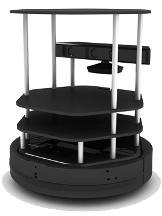

# Práctica 1 - Carrera de robots
>_Por Robert Esclapez García y Julia García Martínez_

*Práctica 1 de la asignatura de Visión Artificial y Robótica.*



---


Para iniciar el simulador 3D Gazebo con el mapa y los robots:

```bash
catkin_make
source devel/setup.bash
roslaunch turtlebot_gazebo_multiple create_multi_robot.launch 
```


## 1.1 Navegación
---
Para poder capturar datos manualmente para el apartado de _navegación_ se utiliza el paquete `send_velocity_boolean`:

```bash
rosrun send_velocity_boolean send_velocity_boolean_node
```

Para ejecutar la _navegación_ y ver cómo el **robot1** realiza el circuito, se utiliza el paquete `robot_navegation`:

```bash
rosrun robot_navegation main.py
```


## 1.2 Imagen Stereo
---
Para poder probar la **Imagen Stereo** `stereo`:

```bash
rosrun stereo stereo_node
```


## 1.3 Detección del otro robot
---
Para poder capturar datos manualmente para el apartado de _detección_ se utiliza el paquete `getPhotosImageRecognition`:

```bash
rosrun getimages getimages
```

Para ejecutar la _detección_ y ver cómo el **robot1** detecta el **robot2**, se utiliza el paquete `robot_recognition`:

```bash
rosrun robot_recognition main.py
```


### Documentación
> Para mayor detalle de la implementación de la práctica, así como los experimentos y problemas encontrados en su realización, ver `VAR1718_P1.ipynb`.