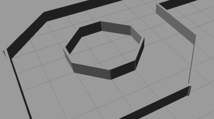
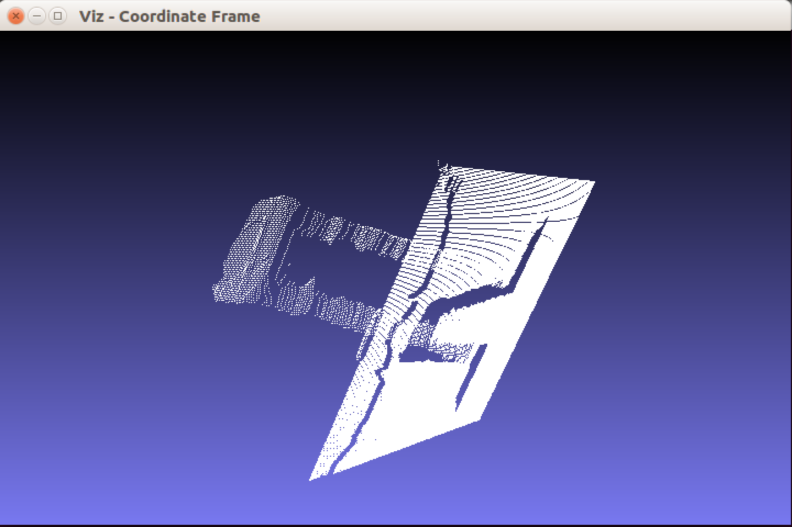

# Práctica 1 - Carrera de Robots

_Julia García Martínez y Robert Esclapez García_


### 1. Introducción

En nuestra práctica hemos realizado los apartados de `1.1.Navegación`, `1.2.Imagen Stereo` y `1.3.Detección de otro robot`.
  
Tanto para la navegación como para la detección del segundo robot hemos usado la solución basada en _DeepLearning_. La red usada en ambos casos se trata de [MobileNet](https://keras.io/applications/#mobilenet). _MobileNet_ está pensada para aplicaciones de visión móvil y se basa en **depthwise separable convolutions**, lo que la hace eficiente.
  
En el apartado de `Aproximación` explicaremos los motivos por los cuales la hemos elegido.
  
En el apartado de _navegación_ teníamos como reto conseguir que el robot realizara el circuito que se nos da inicialmente. Las partes que más problemas **pensábamos** que podrían darnos eran las siguientes:
  
  
  
  
  
Sin embargo, en los siguientes apartados veremos que esto no era del todo cierto.
 
  
En cuanto a la _imagen stereo_ se nos pedía obtener la **nube de puntos en 3D** a partir de las cámaras traseras del robot. En un **principio**, lo hicimos sacando los puntos característicos de las imágenes. Una vez que los obtuvimos hicimos un filtrado para eleminar los puntos que no aportaban gran información (_código del algoritmo abajo_). A continuación, usando [match](https://docs.opencv.org/2.4/doc/tutorials/features2d/feature_flann_matcher/feature_flann_matcher.html) identificábamos coincidencias entre las dos imágenes y obteníamos un resultado rectificado. Sin embargo, no obteníamos el resultado requerido.
  

```cpp
    // min distance
    double min_dist = DBL_MAX;

    for (int i = 0; i < (int)matches.size(); i++)
    { 
        double dist = matches[i].distance;
        if (dist < min_dist) 
            min_dist = dist;
    }

    if (min_dist < 1.0) 
        min_dist = 1.0;

    // save good matches
    const double threshold = 1.5 * min_dist;

    std::vector<cv::DMatch> matches_good;

    for (int i = 0; i < (int)matches.size(); i++) 
    {
        if (matches[i].distance < threshold) 
        {
            matches_good.push_back(matches[i]);
        }
    }

```

  
Por último, para la _detección del robot_ debíamos entrenar nuestra red para que reconociera a **robot2**. Como ya teníamos la red del apartado de _navegación_, nos centramos en conseguir un buen `dataset`. Básicamente obtuvimos muchas imágenes del robot en distintas posiciones, a distintas distancias con respecto el **robot1** y poniendo como obstáculos las paredes del circuito.
  
  

### 2. Aproximación
  
#### 1.1.Navegación
  
> Este apartado al tratarse del eje central de la práctica ha sido el que más tiempo nos ha conllevado y en el que más nos hemos tropezado. El crear un buen capturador de datos, realizar un dataset completo para que la red entrenara adecuadamente, elegir correctamente el tipo de red a usar, etc. eran fundamentales para que el robot completara el circuito.
  
En nuestro proyecto final (_en `Experimentación` explicaremos las distintas versiones usadas_) para el dataset recogemos las imágenes de la cámara del robot y si va a **izquierda** o **derecha**.
Para la guardar las imágenes hemos usado `cv_bridge` tanto en la navegación como en la detección del otro robot:
  

```cpp
    cv::Mat dest;
    cv::resize(cv_bridge::toCvShare(imageMsg, "bgr8")->image, dest, cv::Size(imageSize, imageSize));
    cv::imshow("Vista Conductor", dest);
    cv::imwrite(fileName, dest);
    cv::waitKey(30);
```

  
> Además, para hacer más fácil la obtención de datos, cambiamos la manera de mover el robot por teclado usando `w`, `a` y `d` sin necesidad de pulsar `Enter`.
  
  
  
Para poder entrenar correctamente las distintas redes que queríamos probar sin tener que preocuparnos por la limitación de nuestros ordenadores usamos [Google Colaboratory](https://research.google.com/colaboratory/faq.html). Colaboratory es una herramienta de investigación para aprender y explorar el aprendizaje automático. Gracias a su entorno de ejecución con GPU, pudimos entrenar las redes rápidamente.
  
Este es el modelo de red que hemos usado en la versión final:


```python
       def cnn_model(input_shape):
            mobilenet_model = MobileNet(input_shape=input_shape,
                                        input_tensor=input_tensor,
                                        pooling='avg',
                                        include_top=False,
                                        weights='imagenet')
            x = mobilenet_model.output
            prediction = Dense(1, activation="sigmoid")(x)

            model = Model(inputs=input_tensor, outputs=prediction)

            return model

```

  
Como se puede observar, el modelo es preentrenado inicialmente con `ImageNet` y usa la función `sigmoid` que nos devuelve valores entre **0** y **1** (_izquierda_ o _derecha_).


  ```python  
           model.compile(loss='mse', optimizer='adam', metrics=['accuracy'])
           filepath = './results/weights.{epoch:02d}-{loss:.6f}.hdf5'
           model_checkpoint = ModelCheckpoint(filepath=filepath, save_weights_only=True, mode='auto', period=1)
  ```


Para compilar el modelo era muy importante usar como función de _loss_ `mse`, puesto que el objetivo de la red era minimizar el _loss_ lo máximo posible. A continuación, definíamos con **ModelCheckpoint** la manera en que queríamos guardar los pesos. En nuestro caso, en cada época generábamos un `.hdf5`.
  
La red ha sido entrenada con 100 épocas, 64 de batch y tardaba **78s** por época (aprox.). En total eran 2 horas (aprox.).
  
  
Por último, para la navegación del robot:
  1. Nos subscribíamos a la cámara para ir obteniendo en tiempo real lo que visualizaba el robot.
  2. Con el mejor peso obtenido por la red entrenábamos el modelo.
  3. El modelo iba devolviendo la acción que debía realizar el robot.
  4. Publicábamos al nodo **'/robot1/mobile_base/commands/velocity'** la velocidad linear y angular obtenida como salida de la red.
  

```python
       if (prediction[0][0]*100) < 50:
        move_cmd.angular.z += 0.4
        move_cmd.linear.x += 0.3
       else:
        move_cmd.angular.z += -0.4
        move_cmd.linear.x += 0.3

        self.cmd_vel.publish(move_cmd)
```


  #### 1.2.Imagen Stereo
  
Para la realización de la _imagen stereo_ vamos a necesitar obtener dos imágenes no muy distantes entre ellas. Por lo que nos vamos a subscribir a las dos cámaras traseras de `TurtleBot`. Las imágenes deben ser del mismo tamaño (`altura`**x**`anchura`) y la misma cantidad de canales.
  
Una vez obtenemos las dos imágenes del robot aplicamos el algoritmo de _Heiko Hirschmuller_ implementado en la clase `SGBM` de la librería `openCV`. Dados unos parámetros y las dos imágenes de entrada, obtenemos la imagen de dispersión. 
  
Con la imagen de dispersión y la matriz `Q` generamos la nube de puntos que estábamos buscando.
  
>Ejemplo de salida.
  

  
  
  
  


#### 1.3.Detección de otro robot
  
>Este último apartado era muy parecido al de la navegación. La diferencia recaía en el tipo de dataset generado y en el tipo de salida que devolvía el algoritmo.
  
La red ha sido entrenada con 300 épocas, 64 de batch y tardaba **10s** por época (aprox.). En total eran 50 mins (aprox.).
  
Como se ha mencionado anteriormente, hemos usado `cv_bridge` para la captura de imágenes. Algunos ejemplos de las muestras tomadas del **robot2**:
  
  
  
  
  
  
  
  
Como hemos mencionado en la introducción, la red usada para este apartado es la misma que para la _navegación_. La única diferencia es que no ha sido necesario preentrenar la red con `ImageNet`.
  
La salida obtenida es el porcentaje de detección del otro robot.
  
  

### 3. Experimentación

#### 1.1.Navegación
  
Lo primero que empezamos a realizar fue el conjunto de datos. Al principio capturábamos el **incremento** que se añadían a las velocidades linear y angular y las imágenes **cada vez que pulsábamos una tecla**. El problema que esto conllevaba era la poca cantidad de información que se obtenía. Entonces, decidimos recoger en bucle dicha información.
  
Tras consultar una duda en clase nos dimos cuenta que a nosotros realmente no nos interesaba obtener dicho incremento, puesto que no era preciso en cuanto al momento en que se tomaba la imagen. Pasamos a tomar muestras de la **Odometría** del robot utilizando la librería `nav_msgs/Odometry` y `TimeSynchronizer` para definir un _timestamp_ que recogiera tanto las imágenes como dicha odometría en el mismo punto de tiempo.
  
Una vez que finalizamos la recogida de datos pasamos a investigar acerca del tipo de red a utilizar y **dónde** probarla, puesto que, como hemos mencionado antes, no teníamos recursos para ello.
  
Trasteamos el tema de cómo subir el dataset a Colaboratory y aprender a usar este servidor. Probamos una red que hicimos en la asignatura _Desafíos de programación_ que no funcionaba correctamente puesto que servía para la clasificación de distintas notas musicales.
  
  
  
  
Como se puede observar los resultados son **sospechosamente** buenos (?). Inmediatamente la descartamos.
  
Seguidamente nos metimos de lleno a investigar sobre las redes _ResNet_ y probamos la que proporcionaba _Keras_: `ResNet50`.
  
Tras configurarla de distintas maneras para intentar que se ejecutara tuvimos que desecharla. El problema estaba en que, cuando comenzaba a entrenar, se detenía el entorno antes de la primera época.
  
Inmediatamente buscamos otras opciones y fue cuando encontramos `MobileNet`. Empezamos a generar pesos y a guardarnos los mejores de cada ejecución. Cuando empezamos a probarlos vimos que fallaba en el zigzag, el callejón sin salida y ciertas curvas muy cerradas.
  
  
  
>_Ejemplo de fallo_
  
Decidimos cambiar la odometría por simplemente un valor de **0** o **1** (_izquierda o derecha_). Sin embargo, seguía estando el problema del zigzag y la curva de antes del callejón. Entonces, finalmente, llegamos a la conclusión de que se debía a que el dataset debía completarse con más ejemplos de ese tipo.
  
La manera de afrontar esto fue con la siguiente estrategia: hacíamos que el robot serpenteara, por lo tanto, en el momento en que nos movíamos mucho a la izquierda, el robot tendría en su campo de visión mucha pared a la izquierda y cuando se acercaba mucho a ésta girábamos a la derecha. De esta manera generamos un dataset lo suficientemente preparado para afrontar todas las curvas.
  
  
#### 1.2.Imagen Stereo
  
En este apartado hemos probado los siguientes puntos:
  
  + Diferentes combinaciones de parámetros hasta obtener un resultado deseable.


```cpp
  //Ptr<StereoSGBM> sgbm = StereoSGBM::create(-10,16,11,0,4000,32,0,15,1000,16,StereoSGBM::MODE_HH);
  Ptr<StereoSGBM> sgbm = StereoSGBM::create(-55, 32, 11, 120, 2000, 32, 0, 15, 1000, 16,StereoSGBM::MODE_HH);
``` 


  
  + Utilizar _Surf_ como detector de puntos característicos de ambas de imágenes. Acto seguido, mediante el `matcher` de _FLANN_ obtener las coincidencias de las imágenes, filtrarlas por la **distancia mínima** de los puntos característicos de todos los matches multiplicada por un `threshold`, para quedarnos únicamente con los mejor matches.
  Finalmente obtenemos una imagen en base a esos matches. Faltaría obtener la imagen de disparidad del resultado y llevarlo a la nube de puntos 3D, pero nos daba problemas y al final no se pudo realizar.
  
  
  + Intento de calibración de las cámaras subscribiéndonos a los tópicos informativos del `TurtleBot` sobre las cámaras (`camera_info`). Una vez obtenidas las matrices de las cámaras (_matriz intrínseca_ y _matriz de proyección_) intentar rectificar las imágenes. Abandonada la idea por falta de documentación tanto en los **pdfs** como en la **web**.
  
  
#### 1.3.Detección de otro robot

La primera prueba que realizamos fue llevar a cabo unas **900** fotos aproximadamente donde el robot aparecía y no aparecía. Como utilizábamos una red con salida `sigmoid`, si el robot se encuentraba en la imagen, la salida que devolvía era un **1** y en caso contrario un **0**.
  
El dataset fueron 900 imágenes normalizadas, es decir, 450 con el robot y otras 450 sin él. Las fotos y la apariencia del robot fueron por todo el circuito en diferentes zonas. No se realizaron más pruebas porque obtuvimos unos resultados muy buenos con el primer modelo usado y el dataset. Mostraba la apariencia del robot con una precisión de 99% incluso cuando medio robot estaba tapado por una pared y a bastante distancia.


### 4. Conclusiones

En esta práctica no sólo hemos ampliado nuestros conocimiento de _DeepLearning_, también hemos aprendido a usar el framework **ROS**.
  
Por otro lado, dado que ROS funcionaba correctamente en sistemas _Linux_ y nuestros portátiles con **VirtualBox** no lo soportaban, tuvimos que buscar otros medios. Para el caso del Macbook utilizamos el entorno de virtualización **Parallels Desktop**, puesto que soportaba correctamente ROS y Gazebo al extraer el máximo rendimiento del ordenador. En el caso del segundo portátil con Windows 10 simplemente hicimos una partición e instalamos _Ubuntu_.
  
Una de las cosas que más nos frustró fue perder tanto tiempo en aprender a manejarnos con ROS. El concepto con el que se manejaba este framework nos parecía al principio un poco abstracto. Sin embargo, cuando cogimos la suficiente soltura y conseguimos preparar las clases que capturaran la información necesaria todo avanzó más rápido.
  
Si no llega a ser por el uso que le dimos a Google Colaboratory no hubiésemos podido realizar la parte de _DeepLearning_, puesto que el entrenamiento conllevaba muchísimas horas. Pero gracias a dicha herramienta realizábamos los entrenamientos en menos de 2 horas.
  
Otra de las conclusiones que podemos extraer es la importancia descomunal de realizar un dataset de **calidad**. Prima mucho más la calidad que la cantidad. Totalmente dependiente del modelo de la red. Por ejemplo, al nosotros usar una red con salida sigmoidea (valor entre 0 y 1) no podíamos realizar las rectas pulsando continuamente "_Izquierda-Derecha-Izquierda-Derecha-..._" ya que para una misma imagen le estamos diciendo que puede ser derecha e izquierda al mismo tiempo. Este punto lo solventamos como hemos descrito en el apartado de `Experimentación`.


### 5. Referencias

  [message_filters](http://wiki.ros.org/message_filters)

  [nav_msgs/Odometry](http://docs.ros.org/api/nav_msgs/html/msg/Odometry.html)

  [cv_bridge](http://wiki.ros.org/cv_bridge)
  
  [Converting between ROS images and OpenCV images](http://wiki.ros.org/cv_bridge/Tutorials/UsingCvBridgeToConvertBetweenROSImagesAndOpenCVImages)

  [ROS: Documentation](http://wiki.ros.org)
  
  [ResNet50](https://keras.io/applications/#resnet50)

  [MobileNet](https://keras.io/applications/#mobilenet)
  
  [MobileNets: Efficient Convolutional Neural Networks for Mobile Vision Applications](https://arxiv.org/pdf/1704.04861.pdf)
  
  [Convolutions Types](https://ikhlestov.github.io/pages/machine-learning/convolutions-types/#depthwise-separable-convolutions-separable-convolutions)
  
  [An Overview of ResNet and its Variants](https://towardsdatascience.com/an-overview-of-resnet-and-its-variants-5281e2f56035)

